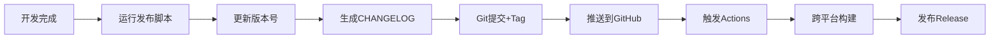

# 🚀 Memos 自动化发布系统

## 📋 系统概览

本项目已经建立了完整的自动化发布系统，基于GitHub Actions工作流，实现了从版本升级到软件包发布的全流程自动化。

## 🎯 核心功能

### ✅ 版本管理
- 自动升级版本号（patch、minor、major）
- 同步更新主项目和renderer项目的版本
- 支持自定义版本号

### ✅ 代码管理
- 自动提交版本更改
- 创建Git标签
- 推送到远程仓库

### ✅ 文档生成
- 自动生成CHANGELOG.md
- 基于Git提交历史分类整理
- 支持Conventional Commits规范

### ✅ 自动构建
- 跨平台构建（Windows、macOS、Linux）
- 多架构支持（x64、arm64）
- 自动发布到GitHub Releases

## 📁 文件结构

```
项目根目录/
├── .github/workflows/
│   └── release.yml              # GitHub Actions工作流
├── scripts/
│   ├── release.sh               # 主发布脚本
│   ├── bump.sh                  # 交互式版本升级
│   ├── changelog.sh             # CHANGELOG生成器
│   └── README.md                # 脚本使用文档
├── package.json                 # 项目配置（含发布脚本）
└── renderer/package.json        # 渲染进程配置
```

## 🔄 发布流程

### 自动化流程


### 手动流程
1. **选择发布方式**：
   - 交互式：`npm run bump`
   - 命令行：`npm run version:patch`
   - 直接调用：`./scripts/release.sh patch`

2. **自动执行步骤**：
   - ✅ 检查依赖和Git状态
   - ✅ 计算新版本号
   - ✅ 更新package.json文件
   - ✅ 生成/更新CHANGELOG
   - ✅ 提交更改并创建tag
   - ✅ 推送到远程仓库

3. **GitHub Actions触发**：
   - ✅ 自动检测新tag
   - ✅ 多平台并行构建
   - ✅ 创建GitHub Release
   - ✅ 上传安装包

## 🛠️ 使用方法

### 快速发布（推荐）
```bash
# 升级补丁版本（1.0.4 -> 1.0.5）
npm run version:patch

# 升级小版本（1.0.4 -> 1.1.0）
npm run version:minor

# 升级大版本（1.0.4 -> 2.0.0）
npm run version:major
```

### 交互式发布
```bash
npm run bump
```

### 预览模式
```bash
# 预览patch升级
npm run release:dry

# 预览CHANGELOG
npm run changelog:preview
```

## 📦 构建产物

发布完成后，用户可以从GitHub Releases页面下载：

### Windows
- `memos-*-setup.exe` - Windows安装程序

### macOS
- `memos-*.dmg` - macOS磁盘映像
- `memos-darwin-*.zip` - macOS应用程序包

### Linux
- `memos-*.deb` - Debian/Ubuntu软件包
- `memos-*.rpm` - RedHat/Fedora软件包

## ⚙️ 配置文件

### GitHub Actions配置
- **文件**: `.github/workflows/release.yml`
- **触发条件**: 推送v*标签或手动触发
- **构建矩阵**: 3个平台 × 2个架构
- **环境变量**: 支持代码签名和公证

### 项目配置
- **主项目**: `package.json` - Electron应用配置
- **渲染进程**: `renderer/package.json` - React应用配置
- **版本同步**: 发布时自动保持一致

## 🔐 安全特性

### Git检查
- 确保工作区干净
- 验证当前分支
- 检查远程同步状态

### 版本验证
- 验证版本号格式
- 防止重复发布
- 确保版本递增

### 用户确认
- 显示操作预览
- 等待用户确认
- 支持预览模式

## 📊 监控和日志

### 发布日志
- 彩色终端输出
- 详细操作记录
- 错误信息提示

### GitHub Actions
- 实时构建日志
- 构建状态通知
- 失败时的详细错误

### Release追踪
- 自动生成Release页面
- 下载统计
- 版本历史记录

## 🎨 特色功能

### 智能CHANGELOG
- 基于Git提交历史
- 自动分类提交类型
- 支持Conventional Commits
- Emoji图标美化

### 多方式交互
- 命令行参数
- 交互式菜单
- npm scripts
- 直接脚本调用

### 灵活配置
- 预览模式
- 仅本地操作
- 自定义版本号
- 跳过特定步骤

## 🔮 未来扩展

### 可能的改进
- [ ] 集成自动化测试
- [ ] 支持预发布版本
- [ ] 集成代码签名
- [ ] 添加发布通知
- [ ] 支持回滚功能

### 集成建议
- [ ] CI/CD流水线优化
- [ ] 质量检查集成
- [ ] 自动化文档生成
- [ ] 性能监控集成

---

## 📞 获取帮助

### 查看帮助
```bash
./scripts/release.sh --help
./scripts/changelog.sh --help
```

### 常用命令
```bash
# 查看脚本使用说明
cat scripts/README.md

# 查看当前版本
node -p "require('./package.json').version"

# 查看最新tag
git describe --tags --abbrev=0
```

### 问题排查
1. 检查Git状态：`git status`
2. 检查依赖：`node --version && git --version`
3. 查看构建日志：GitHub Actions页面
4. 检查发布状态：GitHub Releases页面

---

**作者**: ximing
**邮箱**: ximing@meituan.com
**更新时间**: 2025-01-19
